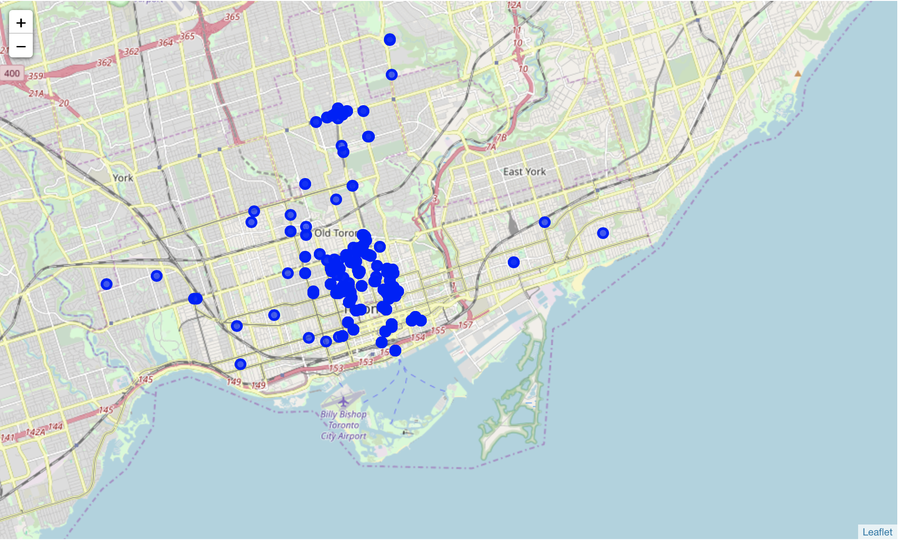
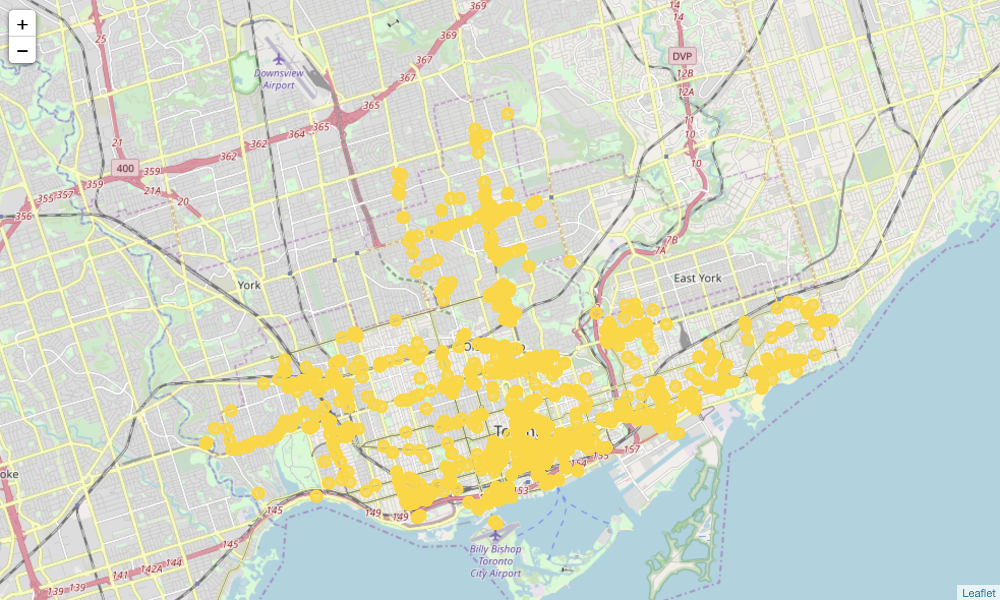
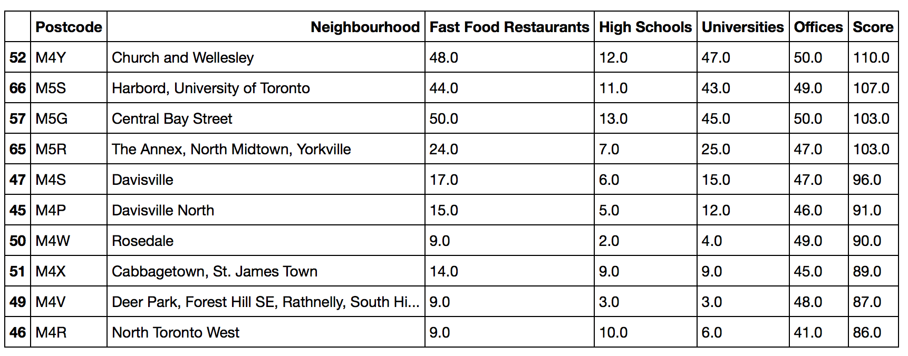
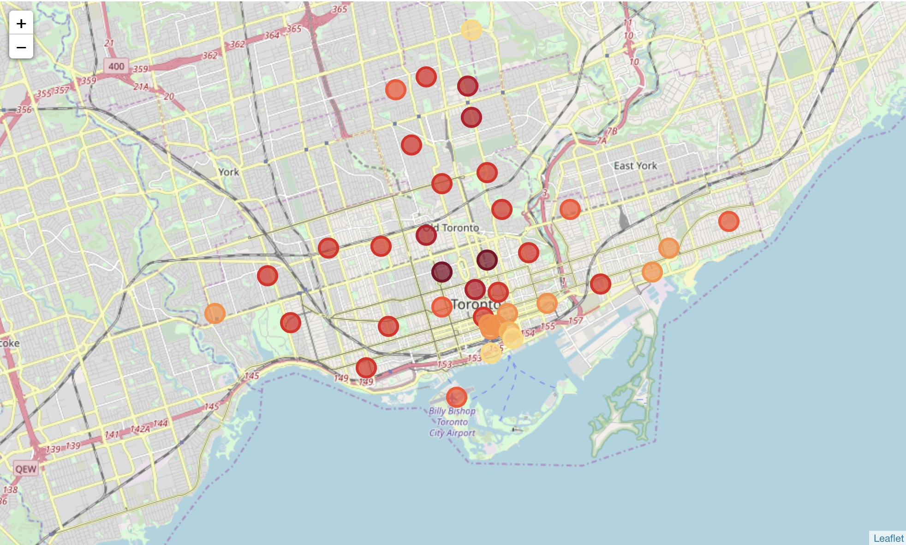

### CAPSTONE PROJECT: BATTLE OF THE NEIGHBORHOODS
#### 1. Introduction and Business Problem
* A famous fast food chain wants to open a new branch in Toronto.
* The customer requested us to find the best area to place the new store.
* We need to choose a place that has small number of competitors and a high number of potential customers.
* We assume more offices/schools will bring more fast food customers, bacause students tend to like fast food and company employees usually take fast food for lunch. And it is better to choose a place has less fast food restaurants since there will be less competitors.

#### 2. Data
We need the following data to solve the problem:
* The Neighbourhood/Latitude/Longitude/Postcode data which can be consolidated from:
    * Wikipedia Toronto postcode/neighbourhood data: https://en.wikipedia.org/wiki/List_of_postal_codes_of_Canada:_M
    * csv file that has the geographical coordinates of each postal code: http://cocl.us/Geospatial_data
* We will obtain the following venues data from Foursquare :
    * the fast food restaurants in the neighbourhood
    * the high schools in the neighbourhood
    * the universities in the neighbourhood
    * the offices in the neighbourhood
* We will then leverage the data to determine which Neighbourhood is the best location for the new branch.

#### 3. Methodology
* First we retrieve the latitude and longitude of each Postcode of Toronto city, this has been done in the previous week.
* We also collected the venues data of fast food restaurants, high schools, universities and offices in each postcode area from Foursquare.
* Then for each area, we compute the number of fast food restaurants, high schools, universities and offices.
* For each of these four kinds of venues, a weight was assigned based on the top priorities defined by the customer. The weights were set to arbitrary values for this project for simplicity. We can always modify them based on real scenarios.
    * We assigned weight 1 to High Schools since high school student are potential customers.
    * Weight 2 was assigned for Universities and offiices, since university students and employees are even better potential customers.
    * Fast food restaurants received a negatiive weight (-2), since they are potential competitors.
* Then, the weighted sums of the number of venues was calculated for each of the 4 venue categories (high school, university, office, fast food restaurants).
* At last, we ranked the areas based on the scores and found the best location for the new fast food branch.

#### 4. Results
##### 4.1 Fast food restaurants in Toronto

##### 4.2 High schools in Toronto

##### 4.3 Universities/ Colleges in Toronto

##### 4.4 Offices in Toronto

##### 4.4 Ranks and Scores of the postcode areas
The following table shows the top 10 best areas:

The following map demonstrates the scores of all the areas, darker color means a higher score. We can notice that the best locations are near Church and Wellesley. This neibourhood is near the University of Toronto and many offices, so it obtained a higher rank. For CBD area, the scores are not very high because there are many existing fast food chains, so we will face a severe competition if we open a new store at CBD.

##### 4.5 A closer look at the best area
Below is the distribution of different kinds of venues at the best area selected. The red circles indicate the potential good locations for the new store, as they are near schools/ offices, and not very close to any competitor. In the plot, red dots indicate existing fast food restaurants, and other color dots indicate a potential source of customers (schools, universities or offices)

#### 5. Discussions
We may obtain a more accurate estimation of the best location by making the following changes:
* Instead of using postalcode to identify the area, we may also try to use the neighbourhood as well.
* When ranking the areas, we may take more factors into consideration. For example, the population densities, rental cost and average income levels of different areas.

#### 6. Conclusion
By utilizing the venues data from Foursquare, we have found that Church and Wellesley (Postalcode M4Y) is the best area to open a new fast food restaurant based on the customer requirement. This area is close to many schools and offices which are great potential sources of customers. It is not recommended to open the new fast food restaurant in the CBD area, because a large number of fast food chains already existed in the CBD area.

